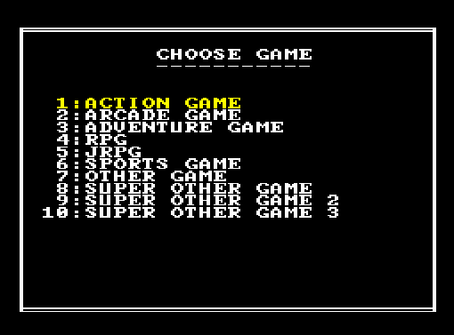
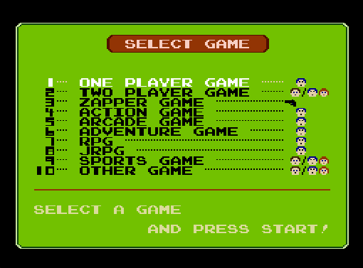

# LegacyMachine - A Lo-Fi LibRetro frontend library
[](https://opensource.org/licenses/MPL-2.0)

Legacy Machine is a Tilengine based LibRetro implementation for creating simple lo-fi frontends intended to simulate the look and feel of the classic video gaming consoles, computers, and arcade machines being emulated.





# Getting Binaries

## Download
Coming soon.

## Build From Source

### Windows
The Windows build uses vcpkg for dependencies. If vcpkg is already installed on your system, set the variable `CMAKE_TOOLCHAIN_FILE` in the `CMakePresets.json` file to the location of `vcpkg.cmake` on your system. By default, it is set to `C:/Libraries/vcpkg/scripts/buildsystems/vcpkg.cmake`.

If vcpkg does not exist on your system, you will need to install it before building.

**Setting up VCPKG**:
* **Step 1**: Create a directory where vcpkg will reside. i.e. `C:\Libraries\vcpkg` or `C:\Dev\vcpkg`. You can keep it wherever you'd like but it is recommended to keep the path short and without spaces.

* **Step 2**: Clone the vcpkg repo with the following command
```
C:\Path\To\Installation>git clone https://github.com/Microsoft/vcpkg.git
```
*Make sure you are in the directory you want the tool installed to before doing this.*

* **Step 3**: Run the following command to install vcpkg
```
C:\Path\To\Installation\vcpkg>bootstrap-vcpkg.bat
```

* **Step 4**: Add vcpkg to the `PATH` environment variable
```
set VCPKG_ROOT="C:\Path\To\Installation\vcpkg"
set PATH=%VCPKG_ROOT%;%PATH%
```
*Setting* `VCPKG_ROOT` *helps Visual Studio locate your vcpkg instance. Adding it to* `PATH` *ensures you can run vcpkg commands directly from the shell.*

For more information on vcpkg visit: [Microsoft Learn - vcpkg overview](https://learn.microsoft.com/en-us/vcpkg/get_started/overview)

* **Step 5**: Configure CMakePresets.json

Be sure any instances of the variable `CMAKE_TOOLCHAIN_FILE` in the Windows build sections of the `CMakePresets.json` file are set to the correct location based on where you installed vcpkg.

#

You are now ready to build the project on windows. Simply open the folder in Visual Studio Community or Visual Studio Code(*requires extensions for C, C++, and Cmake*) and build.


### Linux

CMake 3.23 or higher, along with the dependencies for SDL and libPNG, are required to build in linux. 

If your operating system's repository has an older version of cmake then consider using Kitware's [APT repository](https://askubuntu.com/questions/355565/how-do-i-install-the-latest-version-of-cmake-from-the-command-line) or download directly from [CMake.org](https://cmake.org/download/).

As for the required dependencies, simply install the standard packages `libpng-dev` and `libsdl2-dev`, if you don't have them already.

Once CMake and the required dependencies are set up, run the following commands from the terminal:
```
$ cmake -DCMAKE_BUILD_TYPE=Release -S /path/to/LegacyMachine -B /path/to/build-dir
$ cmake --build /path/to/build-dir
```

### MacOS
Coming soon.

## Documentation
Coming soon.

> [!NOTE]
> Legacy Machine is in it's early stages of development. While it is in a working state, it is still considered alpha and has very basic functionality. Also, Legacy Machine is merely a library for creating frontends and not a stand alone frontend itself. I plan on adding samples in the very near future that will better illustrate it's usage.